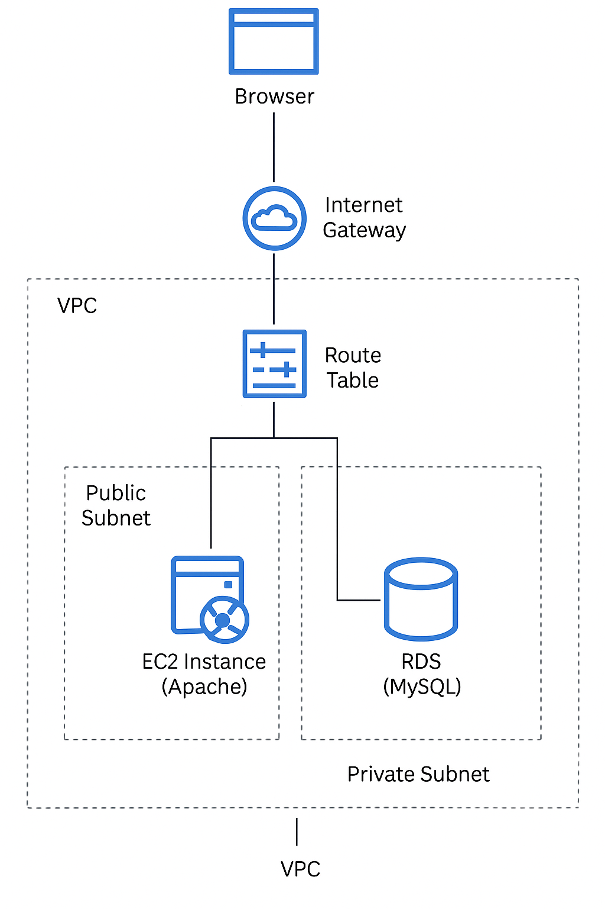

# 🌩️ Scalable 3-Tier AWS Infrastructure using Terraform

This project sets up a **production-grade 3-tier AWS infrastructure** using **Terraform**, including a **public subnet**, **private subnet**, **EC2**, **RDS**, and a **NAT Gateway**. It's modular, secure, scalable, and ready for real-world applications or DevOps job interviews.

---

## 🚀 Architecture Overview

### Components:
- ✅ VPC with custom CIDR
- ✅ Public Subnet (for Bastion/EC2)
- ✅ Private Subnet (for RDS)
- ✅ Internet Gateway + NAT Gateway
- ✅ Route Tables
- ✅ EC2 instance (Amazon Linux 2)
- ✅ RDS (MySQL 8.0) in Private Subnet
- ✅ Security Groups with Least Privilege
- ✅ Remote SSH Access
- ✅ GitHub Repository with IaC

---

## 📦 Tech Stack

| Tool         | Purpose                         |
|--------------|----------------------------------|
| Terraform    | Infrastructure as Code (IaC)     |
| AWS VPC      | Private Networking               |
| AWS EC2      | Compute resource (App server)    |
| AWS RDS      | Managed DB in private subnet     |
| Git + GitHub | Version control & collaboration  |

---

## 📁 Folder Structure

terraform-aws-setup/
├── ec2.tf # EC2 & key pair
├── vpc.tf # VPC, subnets, routing
├── security.tf # Security groups
├── rds.tf # MySQL RDS setup
├── variables.tf # Input variables
├── outputs.tf # Terraform outputs
├── provider.tf # AWS provider block
├── .gitignore # Terraform state/cache ignore
└── README.md # Project documentation

---

## 🧠 Terraform Highlights

- Uses **modular code structure** for clarity
- Manages all networking: VPC, subnets, route tables
- NAT gateway enables secure outbound internet from private subnet
- Private RDS instance accessible **only** from EC2
- `terraform output` provides RDS endpoint

---

## 🛠️ How to Use

### 🧰 Prerequisites:
- AWS CLI & Terraform installed
- AWS credentials set in `~/.aws/credentials`
- Valid EC2 key pair

### 🧪 Steps:

terraform init
terraform plan
terraform apply

Then:

SSH into EC2 → install MySQL client

Connect to RDS: mysql -h <rds-endpoint> -P 3306 -u admin -p

🔒 Security Practices
EC2 SG allows SSH only from your IP

RDS SG allows access only from EC2 SG

RDS not publicly accessible

Infrastructure is destroyable via terraform destroy

👨‍💻 Author
Rohan Mandal
📍 Kolkata, India
🌐 GitHub
💼 DevOps & Cloud Enthusiast

📜 License
MIT License. Use, modify, and share freely.
